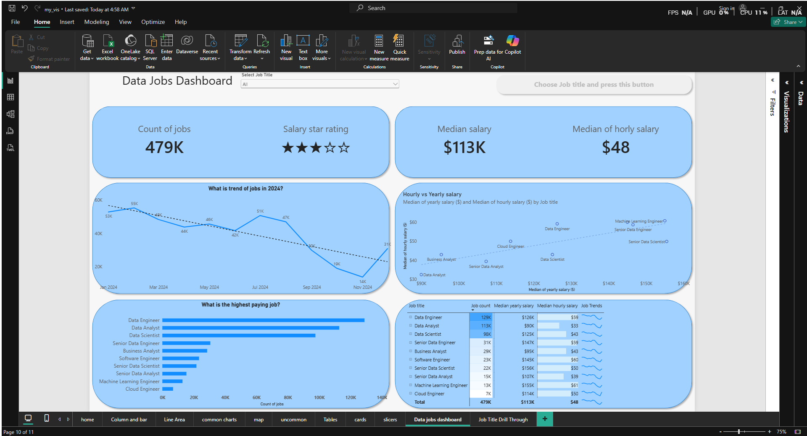
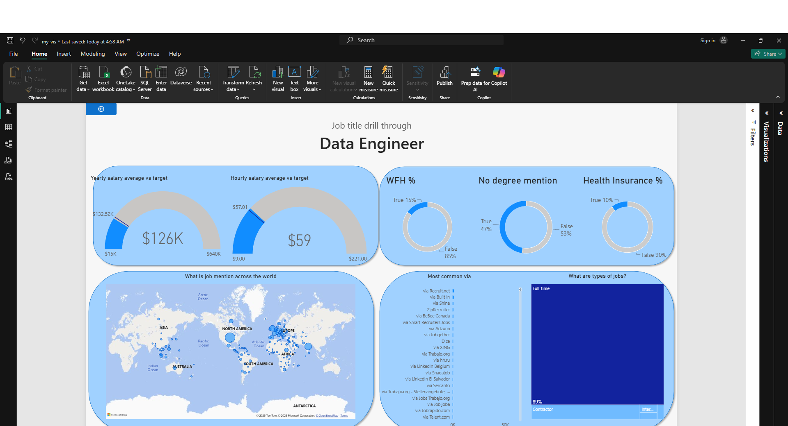

# Data Jobs Dashboard w/ Power BI

## Introduction

This dashboard was created to analyze the data job market, providing clear insights into job availability, salary trends, and top data professions. Using a real-world dataset of 2024 data science job postings, this project provides a single, easy-to-use interactive interface to explore market trends and compensation.

### Dashboard File
You can find the file for the dashboard here: [`my_vis.pbix`](my_vis.pbix).  

## Skills Showcased

This project demonstrates key Power BI functionalities, including:

-   **⚙️ Data Transformation (ETL):** Cleaned and shaped the raw data using Power Query.
-   **🧮 DAX & Measures:** Formulated measures to derive key insights and KPIs like `Median Yearly Salary`, `Median Hourly Salary`, and `Count of jobs`.
-   **📊 Core Visualizations:** Utilized **Bar Charts**, **Line Charts with Trendlines**, and **Scatter plots** to compare salaries and track market behavior over time.
-   **🔢 KPI Indicators & Tables:** Used **Cards** to display top-level metrics and a detailed **Table** featuring integrated sparklines (Job Trends).
-   **🖱️ Interactive Reporting:**
    -   **Slicers & Buttons:** To dynamically filter the report by Job Title and trigger actions.
    -   **Drill-Through:** To navigate from the high-level summary to a contextual, detailed view.

---

## Dashboard Overview

*This report provides both a broad market summary and specific deep dives into individual professions.*

### 1. Main Dashboard (High-Level Market View)

This is the central hub for the data job market in 2024. It showcases:
* Top-level KPIs for total job postings (479K) and median salaries ($113K).
* A timeline analyzing the downward/upward trend of job postings throughout the year.
* A comparative view of yearly vs. hourly salaries across roles like Data Analyst, Data Engineer, and Data Scientist.
* A granular table with built-in visual sparklines for quick trend recognition.

### 2. Job Title Drill Through

This is the deep-dive page. Users can drill through from the main overview to this specific tab to get detailed contextual metrics, salary breakdowns, and trends for a single selected job title.

---

## Conclusion

This dashboard showcases how Power BI can transform raw job posting data into actionable career insights. It allows users to dynamically slice, filter, and analyze the data to make informed decisions about the current job market landscape.