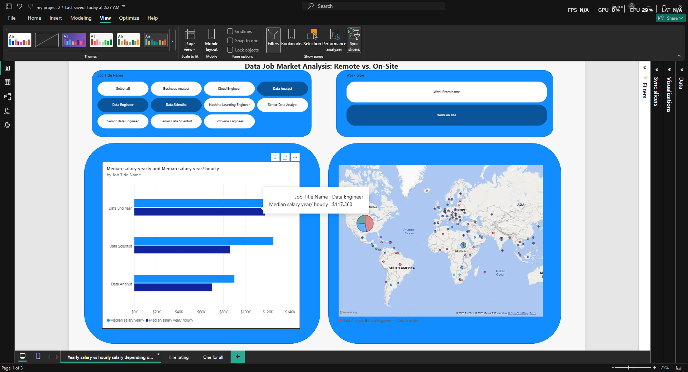

# Data Job Market Analysis: Remote vs. On-Site Dynamics (Power BI)

📂 **Project File:** [Download my project 2.pbix](my%20project%202.pbix)

An interactive Microsoft Power BI analytical dashboard engineered to examine the data career landscape (Data Science, Data Analytics, Data Engineering) with a focus on work flexibility. The project assesses how workplace format (**Remote / Work From Home** vs. **On-Site**) affects compensation benchmarks, global geographic distribution, technology stack demand, and recruitment seasonality throughout the calendar year.

---

## 📌 Project Objectives

* Compare median compensation structures across fixed annual salaries and hourly rate equivalents by specialization and country.
* Provide a flexible multi-dimensional (Ad-hoc) exploration layer featuring dynamic analytical axes and metric parameter switches.
* Assess hiring volume trends and cyclical recruitment behavior throughout the year broken down by job role and work format.

---

## 🛠 Tech Stack & Architecture

* **Power BI Desktop**: UI/UX layer, component layering via Selection Panel, Button Slicers, and Cross-page Slicer Synchronization.
* **Power Query (M)**: Data transformation pipelines, date type standardization to prevent timestamp grain mismatches, null value cleansing, and categorical work type flag generation (`Work type`).
* **DAX**: Modeling of custom metrics (`Job count`, `Median salary yearly`, `Median salary year/ hourly`) and Field Parameters integration.
* **Data Modeling**: Star schema connecting the central fact table (`job_postings_fact`) to dimensions (`Calendar`, `company_dim`, `skills_dim`, `skills_job_dim`) with active relationship handling.

---

## 📊 Report Structure & Slide Breakdown

### Page 1: Yearly vs. Hourly Salary Dynamics
* **Focus**: Evaluation of remuneration methods across roles and worldwide geographic distribution.
* **Core Visuals**:
  * **Clustered Bar Chart**: Side-by-side comparison of `Median salary yearly` and `Median salary year/ hourly` across data job titles.
  * **Map**: Global geographic representation of job demand density by country, featuring pie chart markers to show the proportion of specific roles within each location.
* **Filters**: Work arrangement toggle (`Work From home` vs. `Work on site`) and role selection.

### Page 2: Hiring Trends & Seasonality (Hire Rating)
* **Focus**: Longitudinal volume behavior of data job postings across the calendar year, separated by profession.
* **Core Visuals**:
  * **Line Chart with Legend**: Continuous hiring trajectory showing monthly open job volumes (`Job count`), dynamically split into multiple lines to compare trends across selected job titles (e.g., Data Analyst vs. Data Engineer vs. Data Scientist).
  * **Direct Data Labels**: Prominent data points highlighting hiring activity surges and seasonal contractions.
* **Highlights**: Date granularity resolved via a dedicated date dimension table (`Calendar`) properly joined to job posting timestamps. The addition of the legend allows for direct cross-profession momentum comparisons.

### Page 3: Ad-Hoc Parameter Explorer (One for All)
* **Focus**: Flexible, full-scope data discovery without restrictive top-N truncations, allowing detailed inspection of the entire technology ecosystem.
* **Core Visuals**:
  * **Dynamic Bar Chart**: Visualization driven by DAX Field Parameters.
  * **Field Parameters Interface**:
    * **Category Axis (Dimension)**: Dynamic switching between `Job Title Name`, `Job Country`, `Skills`, and `Company name`.
    * **Measure Selection (Metric)**: Instant recalculation across `Job count`, `Median salary year/ hourly`, and `Median salary yearly`.
* **Highlights**: Allows end users to investigate niche tools and specific salary distributions across remote and on-site roles without modifying underlying report views.

---

## 💡 Key Analytical Findings

1. **Work Format & Pay**: Remote-eligible roles demonstrate competitive median compensation rates relative to on-site equivalents, while drawing from a broader, internationally distributed employer pool.
2. **Hiring Seasonality**: Job posting volumes follow distinct annual patterns, peaking strongly during the spring recruitment wave (March–May) before tapering off toward late autumn.
3. **Skill Valuation**: Advanced data infrastructure technologies and cloud platforms command superior median hourly and annual compensation compared to foundational operational toolsets.

---

## 👨‍💻 For Developers: Exploring Power Query

The dashboard operates perfectly as a standalone file because the data is cached inside the `.pbix`. However, if you want to inspect the data transformation steps (ETL) inside **Power Query**, you will need to map the data source to your local machine:

1. Download the raw CSV files from the [`Data/star_schema_files`](../Data/star_schema_files) folder in this repository.
2. Open `my project 2.pbix` in Power BI Desktop.
3. On the **Home** tab, click the dropdown arrow below **Transform data** and select **Edit parameters**.
4. In the `FolderPath` field, enter the absolute path to the folder where you saved the downloaded CSV files on your PC (e.g., `C:\Downloads\star_schema_files\`). **Make sure to include the trailing backslash `\`.**
5. Click **OK** and then click **Refresh**. Power Query will now successfully load the source files and allow you to explore the applied M code steps.